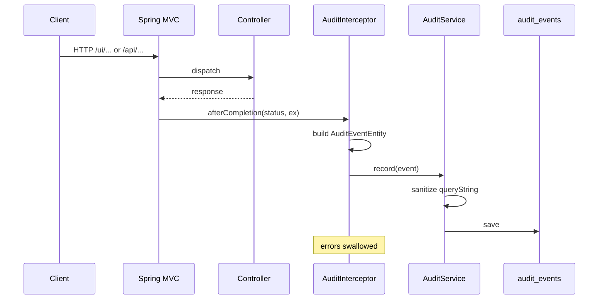

# Audit subsystem

This document describes how request auditing works in this application: persistence (`AuditEventEntity`), capture (`AuditInterceptor`), business rules (`AuditService`), and how users retrieve events (UI and REST).

---

## Purpose

Every handled HTTP request under `/ui/**` and `/api/**` (with documented exclusions) produces one **audit event** row. Events support compliance-style review: who acted, on what path, with what outcome, and—when route patterns expose it—which **case** was involved.

---

## Component map (MVC)

| Layer | Type | Responsibility |
|-------|------|----------------|
| Infrastructure | `AuditEventEntity` | JPA entity mapped to `audit_events` |
| Infrastructure | `AuditEventRepository` | Paged queries by time range and optional case |
| Infrastructure | `AuditInterceptor` | After each request: build entity, call `AuditService.record` |
| Infrastructure | `AuditWebMvcConfig` | Registers interceptor on path patterns |
| Application | `AuditService` | `record()` (sanitize + save), `listEvents()` (authorize + query) |
| Application | `AuditEventMapper` | Entity → `AuditEventDTO` |
| Presentation | `AuditController` | `GET /api/audit` |
| Presentation | `AuditUiController` | `GET /ui/audit` → Thymeleaf |
| Presentation | `AuditEventDTO` | Shape exposed to API and templates |

There is no single class named “Audit”; the **entity** is `AuditEventEntity` and the main **orchestrator** is `AuditService`.

---

## Data model

Table **`audit_events`** (entity `AuditEventEntity`):

| Field | Type | Meaning |
|-------|------|---------|
| `id` | UUID | Primary key (generated) |
| `occurredAt` | `Instant` | Event timestamp (`record()` defaults to “now” if null) |
| `actorId` | UUID | From `Actor.userId()` when the interceptor can resolve the current user |
| `actorRole` | String | `Role.name()` when present |
| `principalName` | String | `request.getUserPrincipal().getName()` |
| `httpMethod` | String | e.g. GET, POST |
| `requestPath` | String | `request.getRequestURI()` |
| `queryString` | String | Raw query string; **sanitized before persist** (see below) |
| `handler` | String | For `HandlerMethod`: `SimpleClassName#methodName`; otherwise simple class name |
| `responseStatus` | Integer | HTTP status from the response object |
| `errorType` | String | Simple name of handler exception, if any |
| `caseId` | UUID | Extracted from path variables when possible (see below) |
| `clientIp` | String | `X-Forwarded-For` first hop, else `remoteAddr` |
| `userAgent` | String | `User-Agent` header |

**Indexes:** `occurredAt`, `actorId`, `caseId` (for list/filter performance).

---

## Recording workflow

### 1. Interceptor registration

`AuditWebMvcConfig` adds `AuditInterceptor` for:

- **Included:** `/ui/**`, `/api/**`
- **Excluded:** `/static/**`, `/app.css`, `/app.js`, `/error**`, `/login**`

So static assets, error pages, and login flows do not generate audit rows.

### 2. Lifecycle hook

`AuditInterceptor` implements `HandlerInterceptor.afterCompletion(...)`. That runs **after** the controller (and view, for MVC), so the audit row includes the final **HTTP status** and any **exception** type passed into `afterCompletion`.

### 3. Building the event

For each request the interceptor:

1. Tries `SecurityActorAdapter.currentUser()` → on failure (e.g. not authenticated), continues with `actorId` / `actorRole` unset rather than failing the HTTP request.
2. Sets identity fields: `actorId`, `actorRole`, `principalName`.
3. Sets request metadata: method, URI, query string, resolved handler name.
4. Sets `responseStatus`, `errorType` (from `ex`).
5. Sets **`caseId`** via `extractCaseId(request)`:
   - Reads `HandlerMapping.URI_TEMPLATE_VARIABLES_ATTRIBUTE`.
   - Uses `{caseId}` if present, otherwise `{id}` if present, parsed as `UUID`.
   - Routes that use another variable name for a case UUID will **not** populate `caseId` automatically.
6. Sets `clientIp` (proxy-aware) and `User-Agent`.

### 4. Persisting via `AuditService.record`

`record(AuditEventEntity)`:

- No-ops if the entity is null.
- Sets `occurredAt` to `Instant.now()` when null.
- Runs **sanitization** on `queryString` (JSON-aware or query-param aware), then `save()`.

Wrapper `try/catch` in the interceptor ensures **audit failures never break the user’s request**.

---

## Listing / review workflow

Both `GET /ui/audit` and `GET /api/audit` delegate to:

`AuditService.listEvents(Actor actor, Instant from, Instant to, UUID caseId, Pageable pageable)`.

### Query parameters (UI and API)

| Param | Required | Default behavior |
|-------|----------|------------------|
| `from` | No | `Instant.EPOCH` |
| `to` | No | `Instant.now()` |
| `caseId` | No | Scope depends on role (see below) |
| `page` | No | `0` (clamped ≥ 0) |
| `size` | No | `50`, clamped to **1–200** |

Sort is fixed: **`occurredAt` descending**.

If `from` is after `to`, the service throws `IllegalArgumentException`.

### Authorization (`listEvents`)

 Preconditions: `actor` non-null and `actor.userId()` non-null; otherwise `NotAuthorizedException` (“Missing actor”).

| Actor role(s) in code | Access |
|----------------------|--------|
| `MANAGER` or `ADMIN` | **Global:** all events in the time window. With `caseId`, only events for that case. |
| `DOCTOR` or `CASE_OWNER` | Events whose `caseId` is in `CaseRepository.findAllByOwnerId(actor.userId())`. Optional `caseId` must be in that set or **NotAuthorizedException**. |
| `NURSE` or `HANDLER` | Same pattern using `findAllByHandlerId`. Empty allowed-set → **empty page** (not an error). |
| Any other role (e.g. `OTHER`) | **NotAuthorizedException** |

**Note on `Actor` resolution:** `SecurityActorAdapter` maps Spring authorities to `Role` for `ADMIN`, `HANDLER`, and `CASE_OWNER`; other authenticated users may receive `OTHER` and then **cannot** list audit events even though requests are still **recorded**. The enum also defines `MANAGER`, `DOCTOR`, and `NURSE` for future or alternate identity wiring.

### Repository queries used

- Managers/admins, no `caseId`: `findAllByOccurredAtBetweenOrderByOccurredAtDesc`
- Managers/admins, with `caseId`: `findAllByCaseIdAndOccurredAtBetweenOrderByOccurredAtDesc`
- Doctor/nurse family, no `caseId`: `findAllByCaseIdInAndOccurredAtBetweenOrderByOccurredAtDesc(allowedCaseIds, ...)`
- Doctor/nurse family, with `caseId`: single-case variant after membership check

Results are mapped with `AuditEventMapper` to `AuditEventDTO` (same field set as the entity for listing).

---

## Sensitive data sanitization (`record`)

Goal: avoid storing secrets in `queryString`.

1. **JSON:** If the string looks like `{...}` or `[...]`, parse with Jackson and recursively redact keys matching a **normalized** sensitive name.
2. **Query string:** Split `&`, redact values for sensitive keys (and key-only flags).
3. **Normalization:** Lowercase, strip non `[a-z0-9_]`, use segment after last `.` for dotted keys.
4. **Redaction value:** literal `"[REDACTED]"`.
5. **Keyword set** (non-exhaustive): includes `password`, `token`, `authorization`, `secret`, `ssn`, credit-card style keys, `refresh_token`, etc. Substring matching also flags variants like `authToken` or `user.password`.

**Not redacted:** Request path and other columns as stored; only the persisted **`queryString`** field is scrubbed in `record()`.

---

## UI

- **Route:** `GET /ui/audit` → template `audit/list.html`.
- **Navigation:** Link in `fragments/header.html` (“Audit”).
- Table shows: time, actor role/id, method, path + query, status, caseId, handler, error type. Empty state copy mentions access as well as “no rows.”

**Security (HTTP layer):** `SecurityConfig` requires authentication for any request not on the permit-all list; there is **no extra** `@PreAuthorize` on audit endpoints—**fine-grained rules are entirely in `AuditService.listEvents`**.

---

## REST API

- **Base:** `GET /api/audit`
- **Response:** `Page<AuditEventDTO>` (Spring Data page JSON)

Same filters and authorization as the UI.

---

## Tests

`ProjektArendehanteringApplicationTests.uiRequest_createsAuditEvent` asserts that an authenticated `GET /ui/cases` increases `AuditEventRepository.count()`, verifying the interceptor → `record` path.

---

## Operational notes

1. **Self-auditing:** Requests to `/ui/audit` and `/api/audit` themselves match the interceptor patterns, so **viewing the audit log creates additional audit rows**.
2. **Unauthenticated traffic:** Excluded paths (login, static) are not audited. Fully unauthenticated requests to protected URLs are handled by Spring Security before controllers; whether an audit row appears depends on whether such requests reach a matching path with the interceptor (typically they are denied without hitting MVC handlers in the same way—behavior is worth validating if you add public API routes).
3. **Case linkage:** `caseId` on events is **best-effort** from `{caseId}` or `{id}` path variables only.
4. **Actor on failed auth:** If the adapter throws, the event may still be stored with `principalName` from the servlet API but without `actorId` / `actorRole`.

---

## File reference

| File |
|------|
| `src/main/java/.../infrastructure/persistence/AuditEventEntity.java` |
| `src/main/java/.../infrastructure/persistence/AuditEventRepository.java` |
| `src/main/java/.../infrastructure/web/AuditInterceptor.java` |
| `src/main/java/.../infrastructure/config/AuditWebMvcConfig.java` |
| `src/main/java/.../application/service/AuditService.java` |
| `src/main/java/.../application/service/AuditEventMapper.java` |
| `src/main/java/.../presentation/dto/AuditEventDTO.java` |
| `src/main/java/.../presentation/web/AuditUiController.java` |
| `src/main/java/.../presentation/rest/AuditController.java` |
| `src/main/resources/templates/audit/list.html` |

This overview matches the codebase as of the branch that introduced these types; adjust this document if paths, roles, or interceptor rules change.
